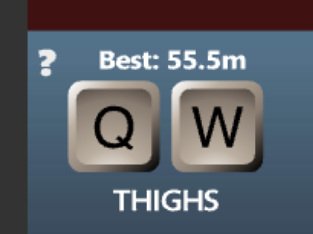

# 🏃‍♂️ RL Project : QWOP

> Selenium, CDP(Chrome DevTools Protocol), 그리고 강화학습(DDQN)을 활용하여 QWOP 게임의 물리 엔진 허점을 파고드는 AI 에이전트 프로젝트입니다.

## 📝 Project Overview

이 프로젝트는 악명 높은 난이도의 플래시 게임 [QWOP](http://www.foddy.net/Athletics.html)를 플레이하는 강화학습 에이전트를 개발하는 것을 목표로 합니다.

초기에는 인간과 유사한 '달리기 자세'를 학습시키려 했으나, QWOP의 물리 엔진 특성상 **"무릎으로 기어가기(Knee Scooting)"** 전략이 넘어질 확률이 낮고 가장 멀리 갈 수 있는 최적의 해(Optimal Solution)임을 발견했습니다. 따라서 **자세 제약을 제거하고 오직 '거리(Distance)'에 집중하는 보상 함수**를 설계하여 고득점 에이전트를 구현했습니다.

## 🌟 Key Features

### 1. CDP 기반의 정밀 입력 시스템 (CDP Key Injection)
* 기존 Selenium의 `send_keys`는 반응이 느리고 `Q+W` 같은 동시 입력을 제대로 처리하지 못합니다.
* 본 프로젝트는 **Chrome DevTools Protocol (CDP)**의 `Input.dispatchKeyEvent`를 직접 호출하여, **지연 없는 키 입력**과 **정확한 동시 키 조합(Multi-key Press)**을 구현했습니다.

### 2. 하이브리드 상태 인식 (Hybrid State Tracking)
* **Vision (MSS + OpenCV):** `mss` 라이브러리로 초고속 스크린 캡처를 수행하고, 최근 프레임을 쌓아(Frame Stacking) 속도와 가속도 정보를 포함합니다.
* **OCR (Tesseract):** 화면 상단의 점수를 실시간으로 판독하여 보상(Reward)으로 변환합니다.
* **Auto-Reset:** 게임 오버 팝업을 인식하고, 점수가 초기화되지 않는 버그(Zombie State) 발생 시 강력 새로고침(F5)을 수행합니다.

### 3. 실용주의적 보상 설계 (Pragmatic Reward Shaping)
* **Distance Delta (Weight 50.0):** 이전 프레임보다 0.1m라도 전진하면 즉각적으로 큰 보상을 부여합니다.
* **Constraint Relaxation:** '넘어짐 방지'나 '자세 유지' 보상을 제거하여, 에이전트가 스스로 물리 엔진을 악용하는 창의적인(기괴한) 주행법을 찾도록 유도했습니다.

## 📊 Performance (Experimental Results)

Random Agent와 제안된 DQN 모델의 성능 비교 결과입니다.

| Model            | Max Distance | Avg Distance | Strategy |
|:-----------------|:------------:| :---: | :--- |
| **Random Agent** |    3.20 m    | 0.6 m | 제자리에서 붕괴 |
| **Trained DDQN** | **55.50 m**  | **13.1 m** | **Knee Scooting (무릎 주행)** |


> *학습된 에이전트는 무작위 행동 대비 **약 20배 이상의 주행 성능**을 보였으며, 안정적인 무릎 주행 패턴을 확립했습니다.*

## 🛠 Prerequisites & Installation

### Requirements
* Python 3.8+
* Google Chrome Browser
* Tesseract-OCR

## 🚀 Usage

### 1. Training (학습)
에이전트를 처음부터 학습시킵니다. 브라우저가 열리고 학습 과정이 실시간으로 표시됩니다.
```bash
Terminal 1
python -m http.server 8000

Terminal 2
 python -m rl.train_dqn
```
### 2. Evaluation (평가)
저장된 모델(qwop_model.pth)을 불러와 성능을 테스트합니다.

```bash
python  python -m rl.evaluate
```
## 🧠 Model Architecture (DQN)
* Input: 84x84 Grayscale Image (Stacked 4 frames)
* **Network:**
  * Conv2D (32 filters, 8x8, stride 4)
  * Conv2D (64 filters, 4x4, stride 2)
  * Conv2D (64 filters, 3x3, stride 1)
  * Fully Connected (512 units)
  * Output: 11 Discrete Actions

* **Action Space:**
  * Hold, Q, W, O, P
  * Combinations: Q+W, Q+O, Q+P, W+O, W+P, O+P

## 📂 Project Structure
```bash
RL_QWOP/
├── capture
├── checkpoints
├── configs
├── envs
      ├── __init__.py
      └── qwop_env.py
├── game
├── rl
    ├── __init__.py
    ├── evaluate.py
    └── train_dqn.py
├── README.md
└── requirements.txt
```